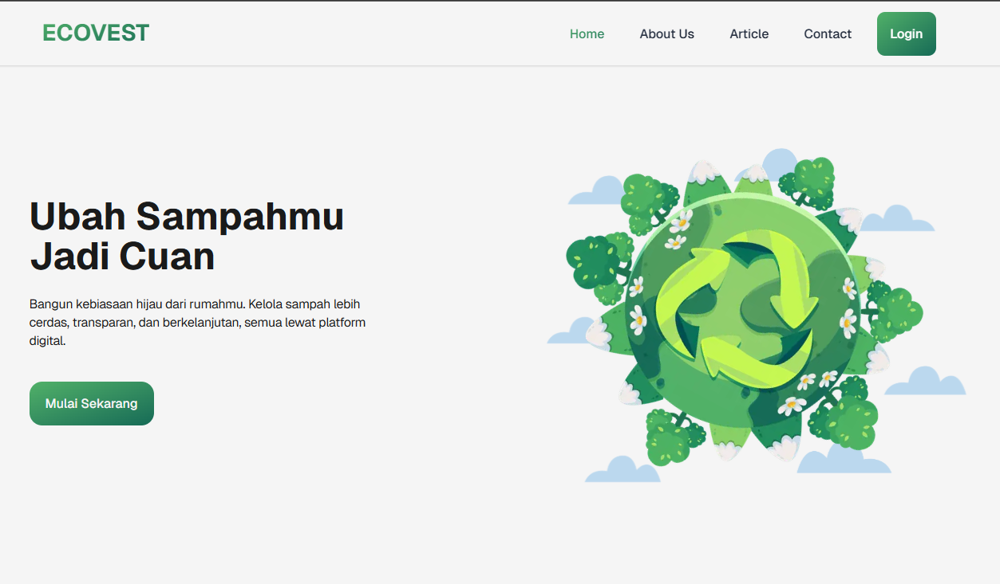
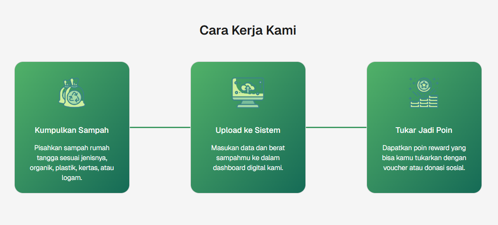
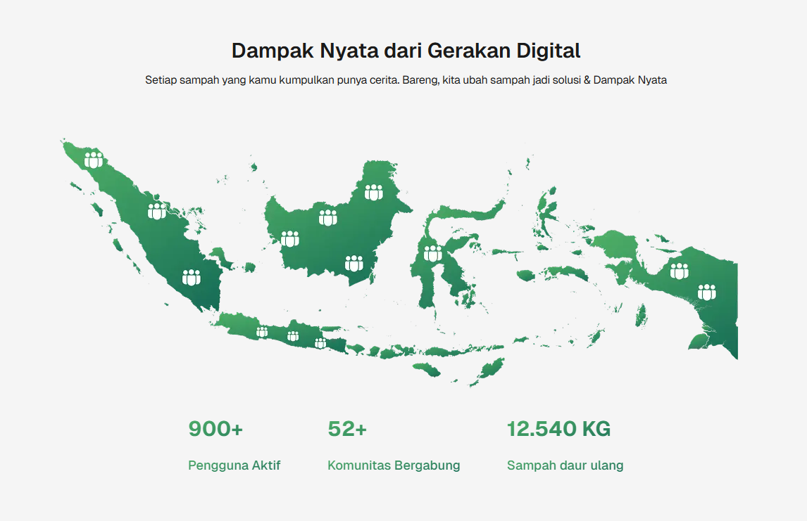
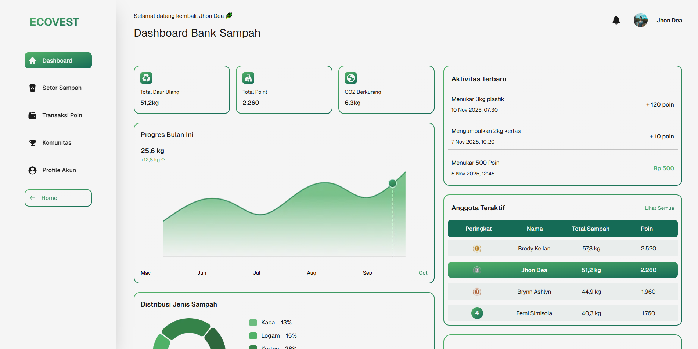
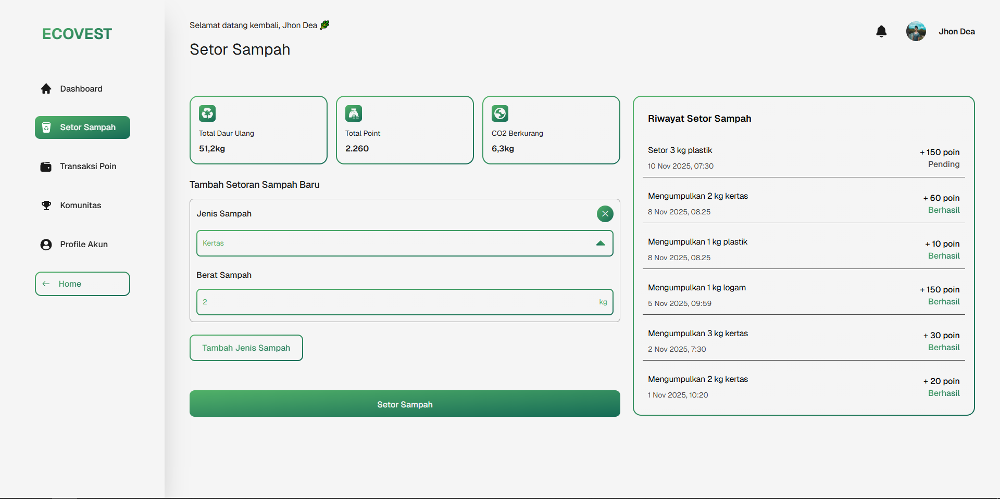
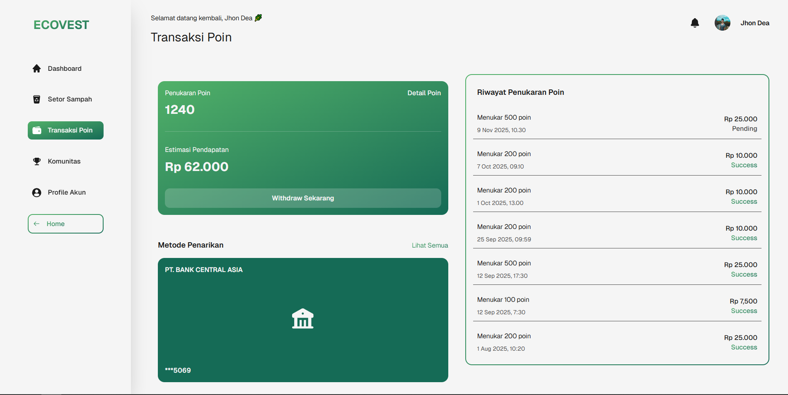
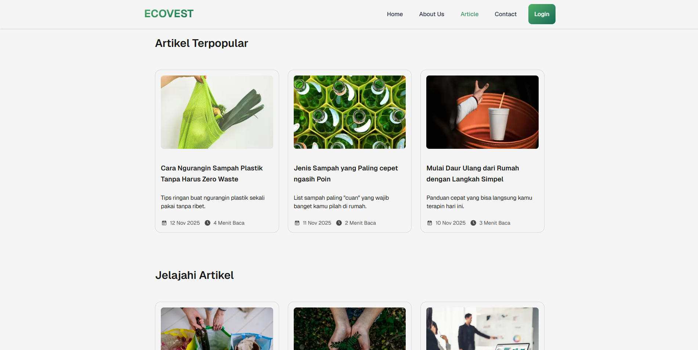
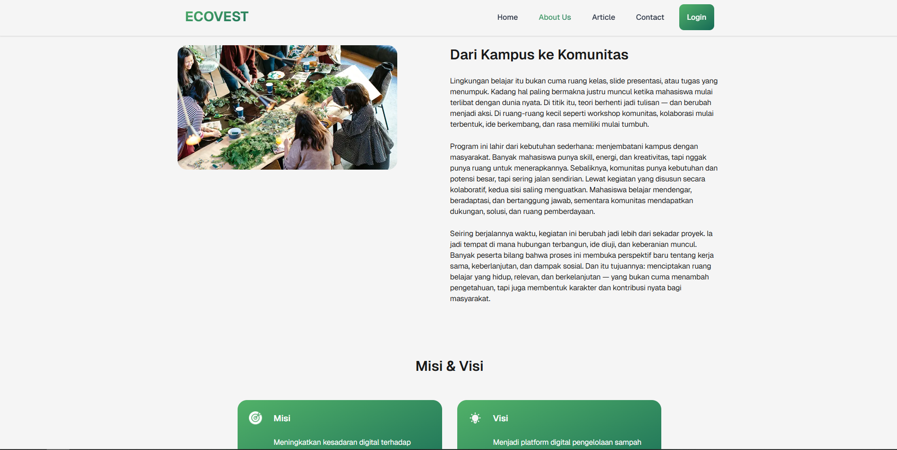
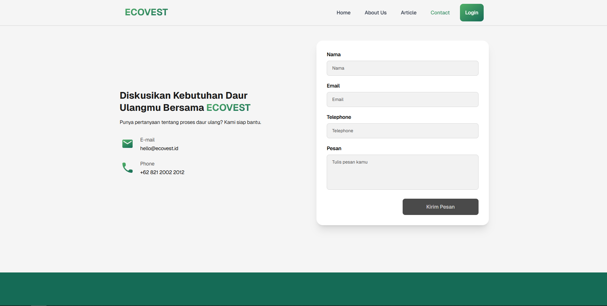

## 🌍 Tentang EcoVest

EcoVest adalah gerakan untuk membuat manajemen sampah dapat diakses, menguntungkan, dan berdampak. Melalui gerakan "Sampah ke Teknologi", kami menghubungkan daur ulang sampah dengan teknologi dan keterlibatan komunitas untuk menciptakan masa depan yang berkelanjutan.

**Misi**: Memberdayakan komunitas melalui daur ulang sampah dan keberlanjutan lingkungan.

**Visi**: Dunia di mana sampah dinilai sebagai sumber daya dan daur ulang mendapat penghargaan.

## 👥 Tim

**Raxiem Studio**

EcoVest adalah hasil kolaborasi dari tim pengembang berbakat yang berdedikasi untuk menciptakan solusi berkelanjutan:

| Nama               | Peran              |
| ------------------ | ------------------ |
| Restu Pandu Damara | UI/UX Designer     |
| Delon Pratama      | Frontend Developer |
| Rizki Farhan Aulia | Content & Research |

Tim kami bekerja sama untuk membawa visi EcoVest menjadi kenyataan dan menciptakan dampak positif pada lingkungan melalui teknologi.

## 📋 Daftar Isi

- [Tumpukan Teknologi](#tumpukan-teknologi)
- [Fitur](#fitur)
- [Instalasi](#instalasi)
- [Memulai](#memulai)
- [Struktur Proyek](#struktur-proyek)
- [Dokumentasi API](#dokumentasi-api)
- [Tangkapan Layar](#tangkapan-layar)
- [Tim](#tim)
- [Live Demo](#live-demo)
- [Lisensi](#lisensi)

## 🛠 Tumpukan Teknologi

### Frontend

- **Framework**: [Next.js 16.0.1](https://nextjs.org) - Framework React dengan server-side rendering
- **React**: 19.2.0 - Pustaka UI
- **TypeScript**: ^5 - Keamanan tipe dan pengalaman pengembangan
- **Tailwind CSS**: ^4 - Framework CSS berbasis utilitas
- **GSAP**: ^3.13.0 - Pustaka animasi untuk transisi yang halus

### Styling & UI

- **PostCSS**: ^4 - Pemrosesan CSS
- **React Markdown**: ^10.1.0 - Rendering Markdown untuk artikel dan konten

### Alat Pengembangan

- **ESLint**: ^9 - Kualitas kode dan linting
- **TypeScript**: ^5 - Pengetikan statis

## ✨ Fitur

### 🏠 Halaman Beranda

- Bagian hero yang menarik menampilkan misi EcoVest
- Bagian "Cara Kerjanya" untuk edukasi pengguna
- Statistik dampak dan metrik kinerja
- Bagian artikel pilihan
- Call-to-action untuk pendaftaran pengguna

### 👤 Dasbor Pengguna

- **Dasbor**: Ringkasan dengan statistik dan grafik sampah
- **Manajemen Profil**: Profil pengguna dan pelacakan aktivitas
- **Manajemen Sampah** (Setor Sampah):
  - Pengiriman sampah dengan formulir
  - Pelacakan riwayat pengiriman sampah
  - Melihat statistik dan metrik sampah
- **Manajemen Transaksi** (Transaksi Poin):
  - Sistem penarikan poin
  - Manajemen metode pembayaran
  - Pelacakan riwayat transaksi
- **Papan Peringkat**: Sistem peringkat komunitas
- **Fitur Komunitas**: Interaksi sosial dan tips keberlanjutan

### 📰 Manajemen Artikel & Konten

- Daftar artikel gaya blog
- Halaman artikel individual dengan konten terperinci
- Rekomendasi artikel terkait
- Sorotan artikel populer
- Kartu artikel responsif

### 📱 Halaman Tambahan

- **Halaman Tentang**: Informasi misi, visi, cerita, dan tim perusahaan
- **Halaman Kontak**: Formulir kontak dan informasi perusahaan
- **Navigasi**: Header global dengan tautan navigasi dan footer

### 🎨 Fitur UI/UX

- Desain responsif penuh (mobile, tablet, desktop)
- Animasi halus yang didukung oleh GSAP
- Arsitektur berbasis komponen yang bersih
- Styling konsisten dengan Tailwind CSS
- Dukungan tema gelap/terang

## 📥 Instalasi

### Prasyarat

- Node.js 18+ dan npm/yarn/pnpm terinstal
- Git untuk kontrol versi

### Petunjuk Setup

1. **Kloning repository**

   ```bash
   git clone https://github.com/deloooonp/ecovest.git
   cd ecovest
   ```

2. **Instal dependensi**

   ```bash
   npm install
   # atau
   yarn install
   # atau
   pnpm install
   ```

3. **Atur variabel lingkungan**

   ```bash
   # Buat file .env.local di direktori root
   # Tambahkan kunci API atau konfigurasi yang diperlukan
   ```

4. **Jalankan server pengembangan**

   ```bash
   npm run dev
   # atau
   yarn dev
   # atau
   pnpm dev
   ```

5. **Akses aplikasi**
   Buka [http://localhost:3000](http://localhost:3000) di peramban Anda

### Build untuk Produksi

```bash
npm run build
npm start
```

## 🚀 Memulai

### Alur Kerja Pengembangan

1. **Memulai Pengembangan**

   ```bash
   npm run dev
   ```

   Aplikasi akan secara otomatis memuat ulang saat Anda melakukan perubahan.

2. **Linting Kode**

   ```bash
   npm run lint
   ```

   Pastikan kualitas dan konsistensi kode.

3. **Build**
   ```bash
   npm run build
   ```
   Membuat build produksi yang dioptimalkan.

### Struktur Proyek

```
ecovest/
├── app/                              # Halaman Next.js App Router
│   ├── globals.css                  # Gaya global
│   ├── layout.tsx                   # Layout root
│   ├── page.tsx                     # Halaman utama
│   ├── about/                       # Halaman tentang
│   ├── article/                     # Halaman daftar dan detail artikel
│   ├── contact/                     # Halaman kontak
│   ├── user/                        # Dasbor pengguna dan fitur
│   │   ├── dashboard/               # Dasbor utama
│   │   ├── profile/                 # Manajemen profil pengguna
│   │   ├── sampah/                  # Manajemen sampah
│   │   ├── transaksi/               # Manajemen transaksi/poin
│   │   ├── leaderboard/             # Peringkat komunitas
│   │   └── sections/                # Bagian dasbor
│   └── sections/                    # Bagian halaman utama
├── components/                       # Komponen React yang dapat digunakan kembali
│   ├── Header.tsx                   # Header navigasi
│   ├── Footer.tsx                   # Komponen footer
│   ├── CTASection.tsx               # Bagian call-to-action
│   └── Links.tsx                    # Tautan navigasi
├── constants/                        # Konstanta aplikasi
│   ├── articles.ts                  # Data artikel
│   └── links.ts                     # Tautan navigasi
├── lib/                             # Fungsi utilitas
│   └── utils.ts                     # Utilitas pembantu
├── types/                           # Definisi tipe TypeScript
├── public/                          # Aset statis
│   ├── icons/                       # Aset SVG dan ikon
│   └── img/                         # Gambar dan ilustrasi
├── package.json                     # Dependensi dan skrip
├── tsconfig.json                    # Konfigurasi TypeScript
├── next.config.ts                   # Konfigurasi Next.js
├── tailwind.config.ts               # Konfigurasi Tailwind CSS
├── postcss.config.mjs                # Konfigurasi PostCSS
└── eslint.config.mjs                # Konfigurasi ESLint
```

## 📸 Tangkapan Layar

### Halaman Beranda


_Bagian edukatif "Cara Kerjanya"_


_Metrik dampak dan statistik_

### Dasbor Pengguna


_Dasbor pengguna dengan statistik dan grafik sampah_


_Antarmuka pengiriman sampah_


_Manajemen poin dan transaksi_

### Halaman Tambahan


_Halaman daftar artikel_


_Halaman tentang dengan informasi perusahaan_


_Formulir kontak dan informasi_

## 🌐 Live Demo

Coba aplikasi EcoVest secara langsung:

🔗 **[https://ecovest-bank-sampah.vercel.app](https://ecovest-bank-sampah.vercel.app)**

## 📝 Lisensi

Proyek ini merupakan bagian dari inisiatif EcoVest. Semua hak dilindungi.

---
